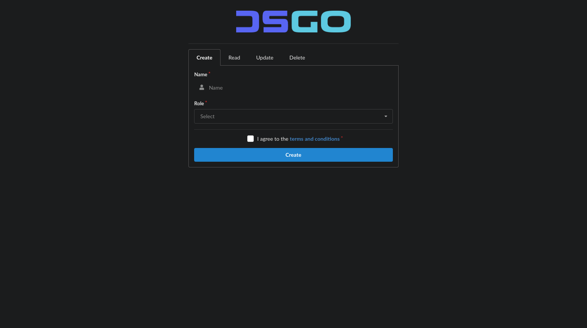

<h1 align="center">

<!-- [](https://github.com/bastean) -->

[](https://github.com/bastean/dsgo)

</h1>

<div align="center">

> Example of interoperability between a Web App and a Discord Bot using a layered architecture.

</div>

> [!IMPORTANT]
>
> - `dsGO` is still in the early stages of development.

<br />

<div align="center">

[](LICENSE)
[](https://goreportcard.com/report/github.com/bastean/dsgo)
[](https://github.com/commitizen/cz-cli)
[](https://github.com/release-it/release-it)

</div>

<div align="center">

[](https://github.com/bastean/dsgo/actions/workflows/upgrade.yml)
[](https://github.com/bastean/dsgo/actions/workflows/ci.yml)
[](https://github.com/bastean/dsgo/actions/workflows/release.yml)

</div>

<div align="center">

[](https://pkg.go.dev/github.com/bastean/dsgo)
[](https://github.com/bastean/dsgo/releases)

</div>

## Showcase

<div align="center">



</div>

## CLI

### Installation

```bash
go install github.com/bastean/dsgo/cmd/dsgo@latest
```

### Usage

> [!NOTE]
>
> - We can follow this guide ["Building your first Discord app"](https://discord.com/developers/docs/quick-start/getting-started#step-1-creating-an-app) to create a new app in case we do not have one already created.
> - SQLite will be used as the default database instead of MySQL.

```bash
dsgo -h
```

```text
Usage: dsgo [OPTIONS]

Example of interoperability between a Web App and a Discord Bot using a layered architecture.

  -app string
        Discord App Id Token (Required)
  -guild string
        Discord Test Guild Id (Optional)
  -port string
        Fiber Server Port (Optional)
  -token string
        Discord Bot Token (Required)
```

## Docker (Demo)

### Usage

> [!NOTE]
>
> - [System Requirements](#locally)
> - We must define our own **Discord** configuration in the file [.env.demo](deployments/.env.demo) by modifying the variables `DSGO_BOT_DISCORD_*`.
>   - The required values are `DSGO_BOT_DISCORD_APP_ID` and `DSGO_BOT_DISCORD_APP_TOKEN`, the other values are optional.
>   - We can follow this guide ["Building your first Discord app"](https://discord.com/developers/docs/quick-start/getting-started#step-1-creating-an-app) to create a new app in case we do not have one already created.
> - MySQL will be used as the default database, SQLite will only be used in case there is a connection problem with MySQL.

```bash
make demo
```

## Workflow

### Functionality

It is a simple monolith where CRUD operations are performed from the Web App and the Discord Bot to the same database, this allows us to manage users from different applications (presentations).

### Folders

1. `pkg/context`

   - It is the logical core that contains all the necessary functionalities that are independent of any presentation (application).

2. `internal/pkg/service`

   - It is responsible for initializing all “context” functionalities so that they are ready for use, as well as for “mapping” certain values to centralize all imports of presentations (applications) in a single place.

3. `internal/app/(bot|server)`

   - These applications will be used as “presentations” in order to serve the functionalities to an end user.

## First Steps

### Clone

#### HTTPS

```bash
git clone https://github.com/bastean/dsgo.git && cd dsgo
```

#### SSH

```bash
git clone git@github.com:bastean/dsgo.git && cd dsgo
```

### Initialize

#### Dev Container (recommended)

1. System Requirements

   - [Docker](https://docs.docker.com/get-docker)

     - [Dev Containers](https://marketplace.visualstudio.com/items?itemName=ms-vscode-remote.remote-containers)

2. Start VS Code

   ```bash
   code .
   ```

3. Open Command Palette

   - Ctrl+Shift+P

4. Run

   ```txt
   Dev Containers: Reopen in Container
   ```

#### Locally

1. System Requirements

   - [Go](https://go.dev/doc/install)
   - [Node](https://nodejs.org/en/download)
   - [Make](https://www.gnu.org/software/make)
   - [Docker](https://docs.docker.com/get-docker)

2. Run

   ```bash
   make init
   ```

#### ZIP

1. [System Requirements](#locally)

2. Run

   ```bash
   make init-zero
   ```

### Run

#### ENVs

> [!IMPORTANT]
> Before running it, we must initialize the following environment variable files:
>
> - [.env.example](deployments/.env.example)
>   - We will have to create a `.env.(dev|test|prod)` for each runtime environment.
>   - In the [.env.example.demo](deployments/.env.example.demo) file, we can see the values that can be used.
>
> In case we only want to run the **Integration** or **Acceptance** tests, in addition to having the `.env.test` file, we must have the following files created:
>
> - [.env.example.test.integration](deployments/.env.example.test.integration)
>   - Rename the file to `.env.test.integration`.
> - [.env.example.test.acceptance](deployments/.env.example.test.acceptance)
>   - Rename the file to `.env.test.acceptance`.

#### Development

```bash
make compose-dev
```

#### Tests

##### Unit

```bash
make test-unit
```

##### Integration

```bash
make compose-test-integration
```

##### Acceptance

```bash
make compose-test-acceptance
```

##### Unit/Integration/Acceptance

```bash
make compose-tests
```

#### Production

```bash
make compose-prod
```

## Tech Stack

#### Base

- [Go](https://go.dev)
- [Fiber](https://docs.gofiber.io)
- [DiscordGo](https://github.com/bwmarrin/discordgo)
- [templ](https://templ.guide)
  - [Fomantic-UI](https://fomantic-ui.com)
- [GORM](https://gorm.io)
  - [MySQL](https://www.mysql.com)
  - [SQLite](https://www.sqlite.org)

#### Please see

- [go.mod](go.mod)
- [package.json](package.json)

## Contributing

- Contributions and Feedback are always welcome!
  - [Open a new issue](https://github.com/bastean/dsgo/issues/new/choose)

## License

- [MIT](LICENSE)
